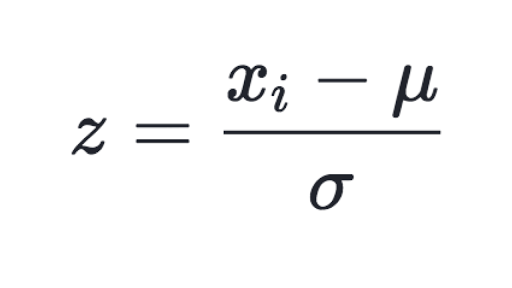

*function1*

Since for many variables, the absolute value is not so representative , what we want is relative value compared with the group. For example, we want to know how old the woman is 'whithin the group', rather than the exact number of her age. We need function as below to do standardization.

```{r, out.width='100%'}

```

```{r  standardize}
standardize<-function(df,col,col_name){
  df<-df %>% 
    mutate(col_sd=({{col}}-mean({{col}},na.rm=T))/sd({{col}},na.rm=T)) %>% 
    select(col_sd,everything()) %>% 
    verify((col_sd*sd({{col}},na.rm=T)+mean({{col}},na.rm=T)-{{col}})<0.001|is.na(col_sd*sd({{col}},na.rm=T)+mean({{col}},na.rm=T)-{{col}})) # to make sure that the transformation works
  names(df)[1]<-paste0(col_name,'_sd') #change name
  df
}

standardize(pima,age,'age')
```


*function2*
For healthy people, the concentration of glucose is in the range of (70~125)mg/dl.
Since what matters is whether glucose concentration is in normal range and how much it is 'abnormal'. So if the glucose concentration is in normal range, we mark it as 0. If it is out of range, we mark it as how much it is away from the range.  

e.g.
  glucose=77  glucose_dev=0
  glucose=126 glucose_dev=126-125=1
  glucose=60  glucose_dev=60-77=-17


So the function is specially designed for column 'glucose'.


1.overall goal: generate a new data frame with a new column, which is the glucose concentration deviation from normal concentration range
2.input: dataframe,column_name
3.output: new dataframe(with new column at front )
4.if someone feeds the function with other column than 'glucose', it should stop execution and give warning'this function is specially designed for glucose deviation,please retry with col_name=glucose')
5.tips:  **`case_when`** function can be employed to calculate the deviation.  **`names`** function can be used to change the name of a specific column.
6.the **assert** range of new column should be  [ min(glucose)-70,max(glucose)-125]


For detailed information you can refer to the function below.

```{r abnormal_glucose}
abnormal_glucose<-function(df,col,colname){
  if (colname!='glucose'){
    print('this function is specially designed for glucose deviation,please retry with glucose')
  }
  else{
  df %>% 
    mutate(glucose_dev=case_when(
      {{col}}<70~{{col}}-70, #hard coded range of (70~125)
      {{col}}>125~{{col}}-125,
      T~0
    ))%>% 
    select(glucose_dev,everything()) %>% 
    verify((min({{col}},na.rm=T)-70)<=glucose_dev&glucose_dev<=(max({{col}},na.rm=T)-125))
  }
}

abnormal_glucose(pima,glucose,'glucose')
```


*function3*
Since the times of pregnant has some correlation with the age, the frequency of being pregnant since  sexually mature  is more sensible to describe women's  health status.

e.g.
We assume that the youngest age to be pregnant is 15. If a woman have been pregnant for 4 times and her age is 25,then the pregnant frequency is  4/(25-15)=0.4 times/year.


Let's create a function to calculate the pregnant frequency.

```{r  preg_frequency}
preg_frequency <- function(df, col,colname) {
   if (colname!='pregnant'){
    print('this function is specially designed for pregnant frequncy,please retry with pregnant')
  }
  else{
  df %>%
    mutate(preg_freq = {
      {
        col
      }
    } / (age - 15)) %>%
    select(preg_freq, everything()) %>% 
    assert(within_bounds(0, 1))# the pregnant frquency should be in the range of (0,1) in the common sense
  }
}

preg_frequency(pima,pregnant,'pregnant')
```

*function4*


Sometimes we want to get the relative value of a variable. For instance,the 'pedigree' is a variable to describe the possibility of onset of diabetes,and we want it to be more intuitive and direct to show the predicting possibility. If we can normalize it,then 'pedigree' being  closer to 1, means the patient are more likely to suffer from diabetes in the 5 years; being  closer to 0, means less possibility of onset of diabetes. Normalized value are more intuitive to show the 'extent' or 'tendency'.


The way to normalize :

(value-min(sample))/(max(sample)-min(sample))

```{r, out.width='100%'}

```


1.overall goal: given whatever column , it will return a new data frame with a new column, which is the nomalized value of the input column.
2.input: dataframe,column_name
3.output: new dataframe(with new column at front )
4.this function can be applied to any numeric variable
5.the assert range should be (0,1)

```{r normalize_pedigree}
normalize<-function(df,col,colname){
  df<-df %>% 
    mutate(col_nz=({{col}}-min({{col}}))/(max({{col}})-min({{col}})))%>% 
    select(col_nz,everything()) %>% 
    assert(within_bounds(0,1),col_nz) #The outcome of normalization should be in range of [0,1]
  names(df)[1]<-paste0(colname,'_nz')
  df
}
normalize(pima,pedigree,'pedigree')
```


## Prepare the data for modeling

```{r  prepare for modeling}
pima_1<-pima %>% 
  standardize(age,'age') %>% 
  abnormal_glucose(glucose,'glucose') %>% 
  preg_frequency(pregnant,'pregnant') %>% 
  normalize(pedigree,'pedigree') %>% 
  select(diabetes,everything())

```


